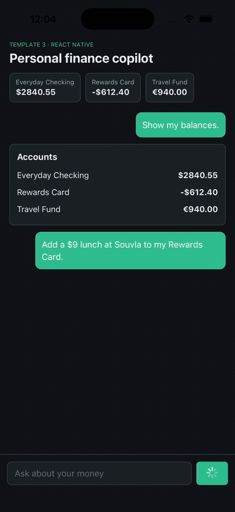

# React Native agent

**OpenAI or OpenRouter + CopilotKit React Native**

Build a phone-native agent that reads app state, renders native cards in chat, and waits for a tap before changing data. The included Expo app is a mobile finance copilot with local sample accounts, budgets, and expense approval. Replace the finance data and tools with your own workflow.

<a href="../../assets/demos/mobile.mp4"></a>

_Edited iOS Simulator recording: read balances, approve an expense, and cancel a second request. Changes stay in local sample data. Click the preview for the full MP4._

This app is deliberately not an npm workspace member. React Native pins its own `react`, `react-native`, and Expo versions, and hoisting those into the root workspace can break the web app.

## Get started

Use Node.js 22+, then clone the kit and install its shared runtime:

```bash
git clone https://github.com/CopilotKit/agents-everywhere-starter-kit.git
cd agents-everywhere-starter-kit
npm ci
cp .env.example .env
```

The Expo app has a separate install under `apps/mobile`, shown below. Choose one model provider in the root `.env`.

For OpenAI:

```dotenv
MODEL_PROVIDER=openai
OPENAI_API_KEY=your-key
MODEL=gpt-5.6-sol
```

For OpenRouter, choose an available model with tool support:

```dotenv
MODEL_PROVIDER=openrouter
OPENROUTER_API_KEY=your-key
MODEL=openai/gpt-5.6-sol
```

Start the runtime from the repository root:

```bash
npm run dev:web
```

In a second terminal, run the mobile app:

```bash
cd apps/mobile
npm ci
npm start
```

Press `i` for the iOS Simulator or `a` for Android. For a physical device, first make the mobile runtime reachable from the device with a deliberate host or deployment, then scan the Expo code.

## Runtime URL

The default endpoint is `http://localhost:3100/api/mobile-copilotkit`, served by `apps/web`. On a real phone, `localhost` means the phone, not your laptop.

| Target | `EXPO_PUBLIC_RUNTIME_URL` |
| --- | --- |
| iOS Simulator | `http://localhost:3100/api/mobile-copilotkit` |
| Android emulator | `http://10.0.2.2:3100/api/mobile-copilotkit` |
| Physical device | A deliberately exposed or deployed runtime URL, for example `http://<your-laptop-LAN-IP>:3100/api/mobile-copilotkit` only after starting Next.js on a LAN interface you trust |

Put the override in `apps/mobile/.env`. The default `npm run dev:web` binds Next.js to loopback for the web approval demo, so a physical device will need an explicitly exposed host, a tunnel/deployment, or a separate runtime start command with the security boundary you intend.

## Try the flow

The [React Native walkthrough](../../dev-docs/template-walkthroughs/mobile/README.md) shows iOS Simulator evidence for startup, balances, approval, cancellation, and formatted assistant output.

Ask:

```text
Show my balances.
```

Expected: `list_mobile_accounts` renders a native account card.

Ask:

```text
How am I doing on budgets?
```

Expected: `list_mobile_budgets` renders spent/limit rows.

Ask:

```text
Add a $9 lunch at Souvla to my Rewards Card.
```

Expected: `add_mobile_expense` renders an approval card. Tapping **Add expense** updates the local in-memory account balance and returns a local transaction ID. Tapping **Cancel** changes nothing.

## Customize these files

| Piece | File |
| --- | --- |
| App shell | [App.tsx](App.tsx) |
| Headless chat | [src/chat.tsx](src/chat.tsx) |
| Finance sample state | [src/finance.ts](src/finance.ts) |
| CopilotKit tools and app context | [src/tools.tsx](src/tools.tsx) |
| Runtime URL | [src/config.ts](src/config.ts) |
| Mobile runtime endpoint | [../web/src/app/api/mobile-copilotkit/[[...path]]/route.ts](../web/src/app/api/mobile-copilotkit/[[...path]]/route.ts) |
| Mobile prompt | [../../packages/agent-core/src/mobile-finance-prompt.ts](../../packages/agent-core/src/mobile-finance-prompt.ts) |

Imports come from `@copilotkit/react-native/headless` so the template avoids optional native peers from the prebuilt chat UI. `index.js` imports `react-native-get-random-values` before CopilotKit polyfills, then registers the Expo app.

`metro.config.js` routes the transitive `jose` dependency through its browser export for native bundles. This is intentionally narrow: it does not stub Node built-ins or mask missing native functionality.

## Make it yours

Good mobile fits include field checklists, travel plans, patient intake preparation, fitness logs, inventory counts, and expense capture. Keep the pattern: app context first, native rendered result, explicit approval before a local or external write, and a visible result after the tap.

## Give this to your coding agent

The existing Expo template runs with the configured model provider. Follow [Get started](#get-started), including its runtime in `apps/web`. Preserve the separate mobile install and device networking, and verify the native app. The sample finance data is local and does not persist after restarting the app.

```text
Read the root hackathon overview, rules, sponsor guide, AGENTS.md, and
apps/mobile/README.md. Follow the mobile setup instructions, including the
runtime in apps/web. Adapt apps/mobile to our mobile workflow. Keep
CopilotKit React Native headless APIs for app context, native tool rendering,
and human-in-the-loop approval. Keep the runtime URL/device networking notes.
Replace sample finance state and tools with our own app state and one complete
approved action. Run npm ci --prefix apps/mobile, npm test --prefix apps/mobile,
npm run typecheck --prefix apps/mobile, and the relevant root checks. Record
OpenRouter, physical-phone, and OCR evidence separately if your submission
depends on those paths.
```

## Verify and limits

Run `npm test`, `npm run typecheck`, `npm run bundle:ios`, and `npm run bundle:android` from `apps/mobile` before recording. The Expo app changes local sample state only. It does not connect to bank accounts, cards, payment services, external storage, messaging providers, or the OpenAI Realtime voice route.

OpenRouter chat follows the shared root model settings. OCR, physical-device networking, and OpenAI Realtime voice are separate capabilities and need their own evidence if your submission depends on them.

## Upstream source

Inspired by CopilotKit PR [#5430](https://github.com/CopilotKit/CopilotKit/pull/5430), `examples/showcases/react-native-personal-finance` at commit `6815a3eed0d80570cc17c121d952b94d5543d0a7`. This app adapts the concept into the starter kit's existing Expo app and shared web runtime. It does not copy the standalone bare native project, screenshots, video, Git LFS media, or credentials.
