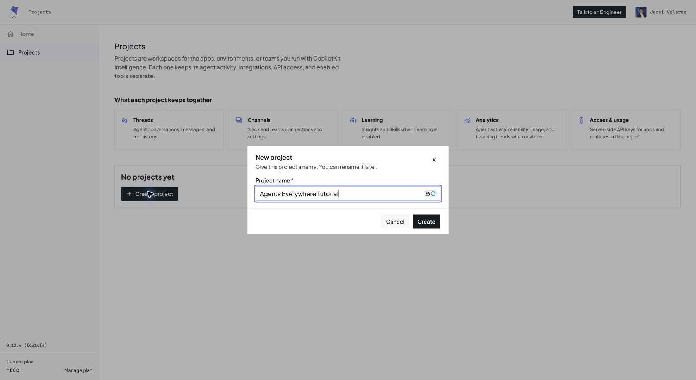
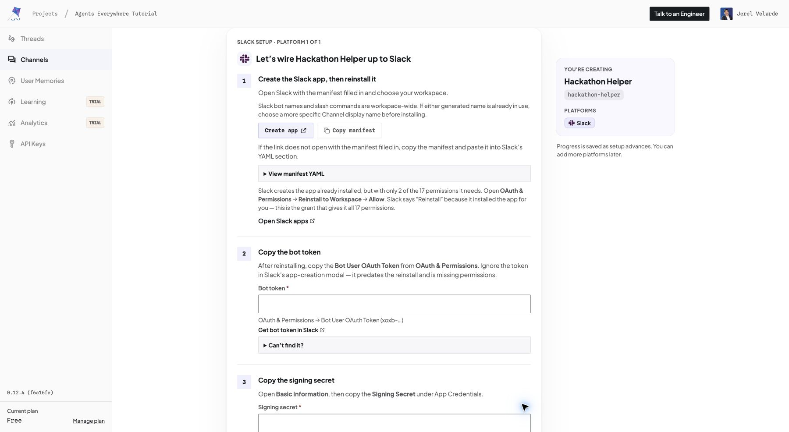
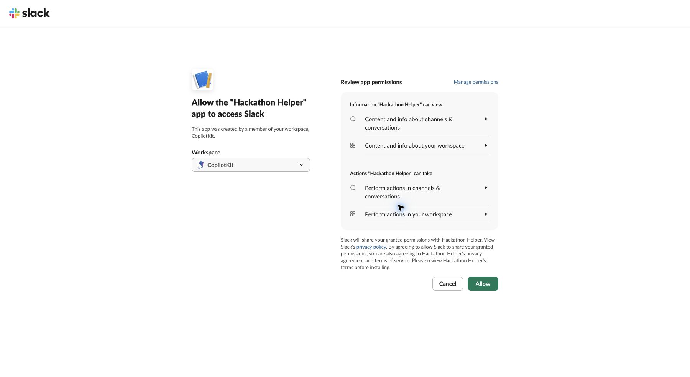
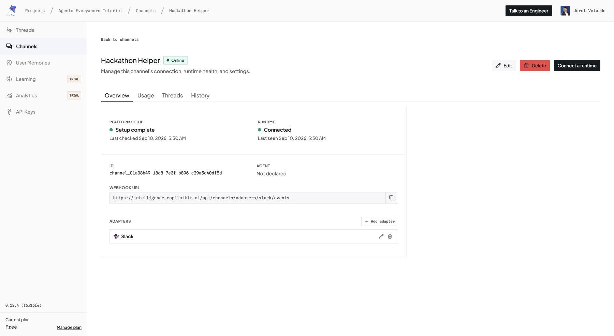

# Build your first Slack agent with CopilotKit Channels SDK

[Back to the starter kit](../../README.md) · [Setup reference](../setup.md)

Take this starter from account sign-in to an agent that reads a Slack thread, renders a native incident card, and follows the conversation without another mention. CopilotKit Intelligence manages the Slack connection; the **Channels SDK** connects your local agent, tools, and native UI to it.

The screenshots come from a real run on September 10, 2026. We used an existing account, created a new project, and tested a synthetic incident. Credential entry is intentionally not pictured. Slack images are crops of the actual thread, with unrelated workspace navigation excluded.

**Prefer agent-assisted setup?** Start with [the current Channels onboarding prompt](../../apps/channel/README.md#get-started). It installs the maintained setup skill; give the emitted prompt to your agent and select Slack with the existing `apps/channel` app. Use this captured walkthrough as a manual reference when a dashboard step needs illustration.

## Before you start

You need Node.js 22+, a CopilotKit Intelligence account, permission to install an app in your Slack workspace, and API access to one supported model provider. An existing API key works; a ChatGPT browser session alone does not configure this starter's model access.

Use your own workspace and a dedicated demo channel. The example names below are **Agents Everywhere Tutorial** (project), **Hackathon Helper** (bot), and `hackathon-helper` (Channel code). Choose a different bot name if it is already taken in your workspace.

## 1. Sign in and create an Intelligence project

Open [CopilotKit Intelligence](https://intelligence.copilotkit.ai), enter your email, and complete the verification flow. New users should complete the account onboarding shown by the service; this captured run signed into an existing organization.

Open **Projects → Create project** and enter **Agents Everywhere Tutorial**. A project groups your Channels and agent activity.



**Check:** Your new project opens and exposes **Channels** in the sidebar.

## 2. Name your Channel and select Slack

Open **Channels → Create channel**. Enter **Hackathon Helper**, confirm the generated code is `hackathon-helper`, select **Slack**, and continue.

The display name is for people. The code must exactly match the value passed to `createChannel({ name })`; this starter reads it from `CHANNEL_CODE`.


## 3. Create and install the Slack app

Select **Create app** in the wizard. It opens Slack with a manifest containing the bot settings, permissions, event subscriptions, and CopilotKit Intelligence endpoints. If the link does not populate the manifest, use **Copy manifest** and paste it into Slack's manifest editor.



Choose your workspace, select **Next**, and review the permissions. The captured manifest requests 17 bot scopes covering mentions, assistant behavior, conversation history, messages, files, reactions, and user information. Have your workspace administrator review access where required.

Select **Create and Install**, then **Allow** on Slack's authorization screen for that workspace.



**If the original button stays disabled:** Look for a newly opened authorization tab and check **Your Apps** before retrying. In our run, Slack created the app and opened authorization separately.

**Check the installation:** Follow the wizard's **OAuth & Permissions → Reinstall to Workspace → Allow** instruction if needed to grant the full manifest scopes. The wizard warns that the initial app-creation token can lack permissions. Copy the Bot User OAuth Token from OAuth & Permissions after the full grant, rather than from the initial creation modal.

## 4. Connect the Slack credentials to Intelligence

In Slack's app settings:

1. Copy **OAuth & Permissions → Bot User OAuth Token** into the wizard's **Bot token** field.
2. Copy **Basic Information → App Credentials → Signing Secret** into **Signing secret**.
3. Continue to the review step and select **Create channel**.

Keep both credentials private. Do not paste them into chat, screenshots, commits, or your submission. The managed integration uses Intelligence's HTTPS event and interaction endpoints; this walkthrough does not enable Slack Socket Mode or require an app-level token.

**Check:** The Channel overview reports **Platform setup: Setup complete**. **Waiting for runtime** is expected until the local process connects. The runtime snippet in the wizard is generic; the starter already implements the runtime and agent, so continue with its configuration below.

## 5. Install the starter and select your project

```bash
git clone https://github.com/CopilotKit/agents-everywhere-starter-kit.git
cd agents-everywhere-starter-kit
npm ci
npx --yes copilotkit@latest login
npx --yes copilotkit@latest project select --project agents-everywhere-tutorial --json
```

Replace `agents-everywhere-tutorial` with your actual project slug. CLI login must use the organization containing the project. These commands were executed during the captured run; terminal setup was not recorded as screenshots.

The CLI writes `.copilotkit/project.json` and provisions `CPK_INTELLIGENCE_API_KEY` into root `.env`. **This starter reads `INTELLIGENCE_API_KEY` instead.** In your editor, add `INTELLIGENCE_API_KEY` with the same value as the CLI-provisioned key, keeping both entries. Do not overwrite `.env` with `.env.example` after provisioning.

Add the following configuration to root `.env`, replacing the model-key placeholder privately:

```dotenv
MODEL_PROVIDER=openai
OPENAI_API_KEY=replace-with-your-existing-api-key
CHANNEL_CODE=hackathon-helper
LOG_LEVEL=debug
PORT=3017
```

With `MODEL` unset, the starter uses its default model. To choose a model available to your account, or use OpenRouter instead, follow [model configuration](../model-switching.md). Model access and billing belong to your selected provider, separately from Intelligence.

**Check:** Root `.env` contains `INTELLIGENCE_API_KEY`, the selected provider's key, and a `CHANNEL_CODE` matching the managed Channel. Never commit `.env`.

## 6. Start the Channels runtime

```bash
npm run start --workspace channel
```

Expected output:

```text
✓ Channel "hackathon-helper" online — listening on :3017
```

Keep this terminal running. Refresh the Channel overview in Intelligence and check for **Online**, **Setup complete**, and **Runtime: Connected**.



The screenshot's Agent field reads **Not declared**; connection health alone does not prove a model response. Verify actual delivery in the next steps. No public tunnel is needed: the runtime connects outbound to the managed gateway. For hosting beyond your laptop, use the [deployment guide](../deploy.md).

## 7. Invite the bot and ask for an incident card

In your demo Slack channel, run:

```text
/invite @hackathon-helper
```

Select the bot from Slack's autocomplete. It should join and post the starter's welcome card. That welcome is predefined and does not test model access.

Start a new message, type `@hackathon-helper`, and **select the autocomplete result** so it becomes a linked mention. Append this prompt and send:

> Tutorial demo (synthetic incident): at 09:00 UTC demo checkout started returning 500s for 12% of requests after deployment v42. Maya is investigating. Read this thread and render a native incident card with the known facts and next investigation step. Do not execute production actions.

Open the reply thread. In the captured run, the bot called `read_thread` and `incident_card`, then rendered the impact, start time, owner, known facts, and a next investigation step.


**Check:** You receive a native card with the supplied facts. A plain-text `@name` is not a resolved mention and will not trigger the mention handler. The card's severity was inferred by the agent; it was not supplied in the prompt.

## 8. Continue the conversation without another mention

Reply **inside that same thread**, without tagging the bot again:

> Synthetic update: at 09:12 UTC Maya isolated a missing environment variable in v42. In the demo environment she restored it, and at 09:15 UTC errors returned to baseline. Show a native timeline and summarize the remaining verification.

The captured follow-up called `read_thread`, `timeline`, and `incident_card`. It rendered a three-event native table and a resolved incident card with verification steps. The bot reports the synthetic actions supplied by the user; it did not perform them.


**Why the environment matters:** The initial mention subscribes the thread. The follow-up handler checks that subscription and reuses the surrounding conversation. Users can continue work where it is already happening, with native Slack UI instead of transferring the whole incident to another chatbox. The captured table is wider than the thread panel and may require horizontal scrolling.

## 9. Make it your hackathon project

Change one workflow and demonstrate why it belongs in its environment:

- Edit the [shared prompt](../../packages/agent-core/src/prompt.ts) for your intended users.
- Add context, handlers, or tools in the [Channel definition](../../apps/channel/src/channel.tsx).
- Adapt the [native cards](../../apps/channel/src/components.tsx) and [tools](../../apps/channel/src/tools.tsx) to the action your users need. Follow the [tools and context guide](../tools-and-context.md).
- Add a [sponsor integration](../../using-sponsor-tools.md) when it creates a useful result: Exa for grounded research or Ambiguous AI for a persistent workplace action.

Optional search needs its own configuration. Approval cards in this starter record a decision; they do not execute production actions by themselves. The welcome card's search and production-action wording should be adapted to the capabilities you actually implement.

Use the [submission checklist](../../SUBMISSION.md) to explain what you inherited, what you built during the event, and the value added by the environment. This pre-existing tutorial is a starting point, not a hackathon submission.

## Observed limitation and troubleshooting

Both model-generated native responses arrived during this run. The runtime also logged `packet_out_of_order` and a closed delivery-path error, and the screenshot still shows a working indicator. This verifies content delivery and contextual follow-up, **not a clean completion of every delivery lifecycle**. The underlying error has not been fixed in this documentation change.

If you encounter that behavior, inspect runtime logs and Intelligence's Channel history before treating the interaction as complete. Record SDK/runtime versions and the delivery ID when reporting the failure, without credentials. Use the [troubleshooting guide](../troubleshooting.md) for setup, connectivity, and model failures.
