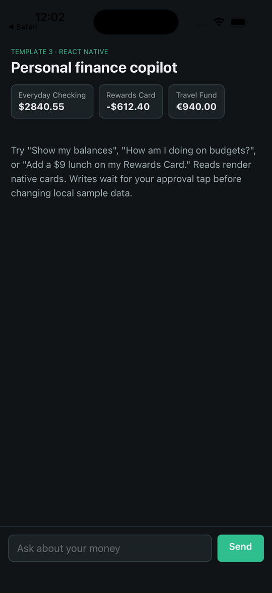
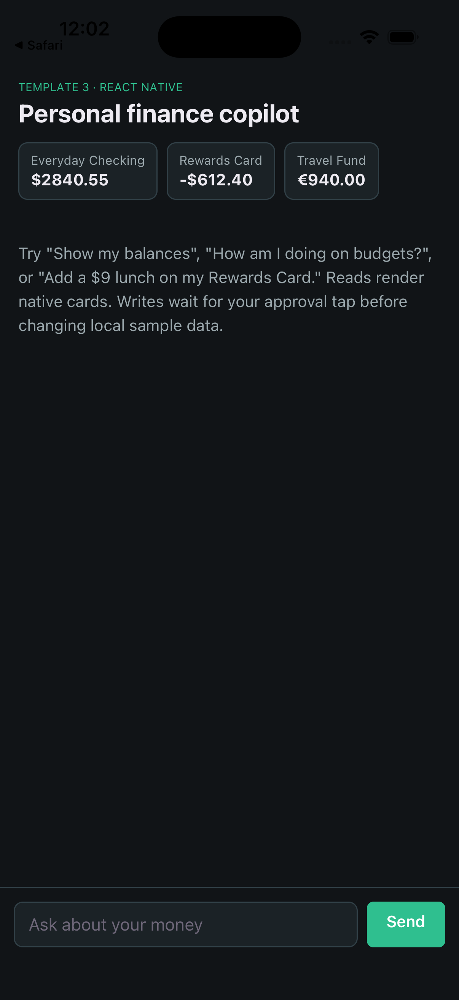
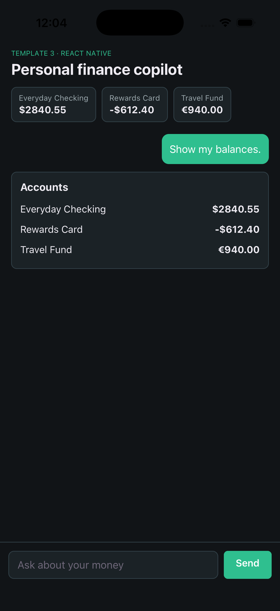
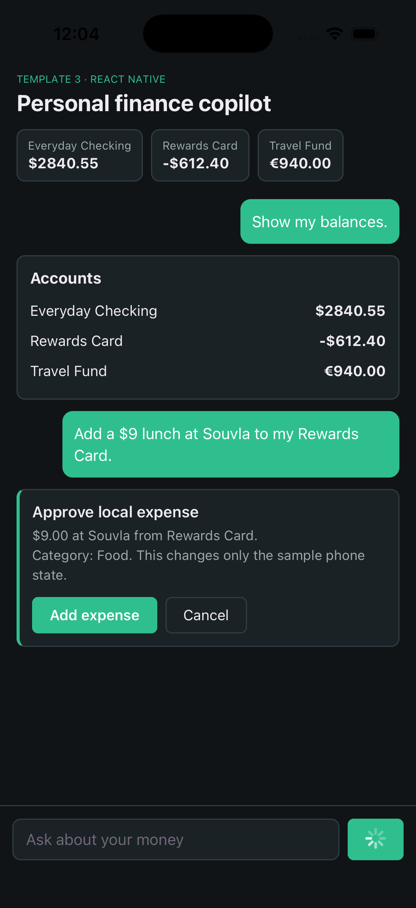
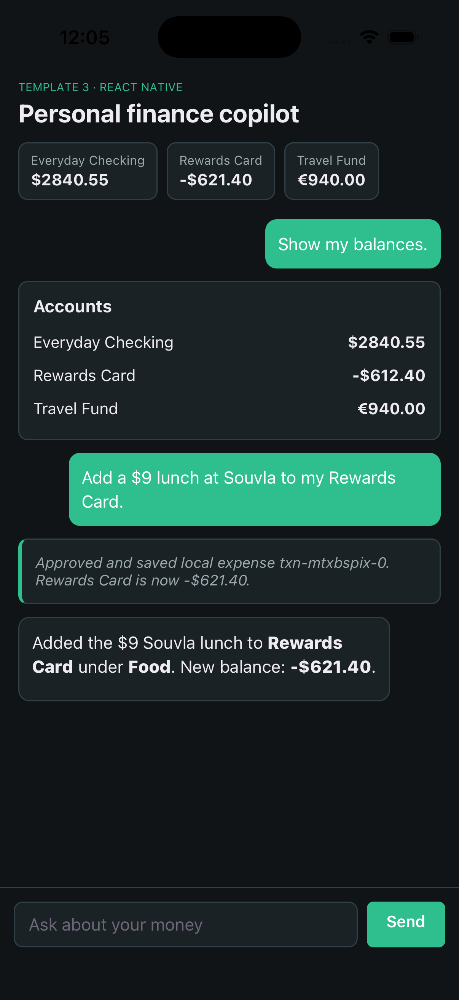
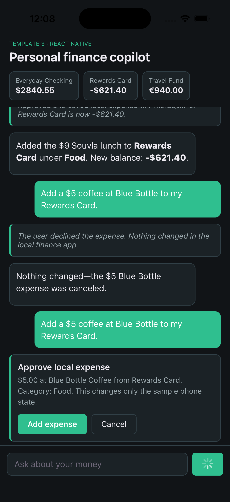
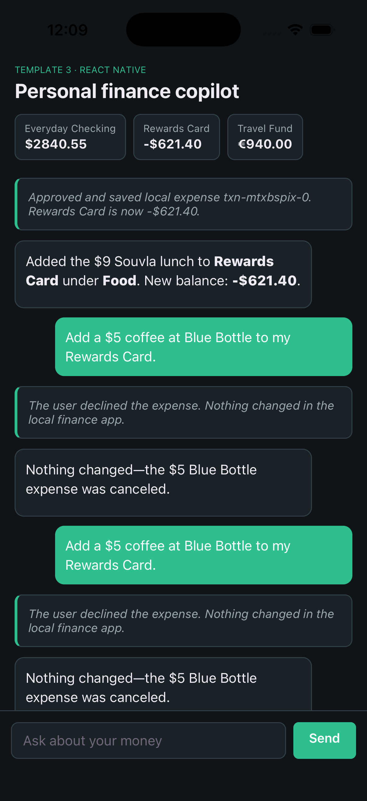
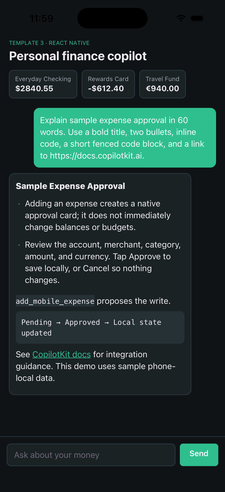

# React Native template walkthrough

[Back to developer docs](../../README.md) · [Template guide](../../../apps/mobile/README.md)

This guide lists the React Native checks to reproduce from your own simulator or device. The current template evidence covers an iOS Simulator run with Expo Go, OpenAI `gpt-5.6-sol`, and local sample finance state; it does not claim an OpenRouter live run, physical phone networking, or OCR verification.



The animated screenshot walkthrough is assembled from the reviewed screenshots below. It is not a continuous screen recording.

## 1. Start the runtime and Expo

Run `npm run dev:web` from the repository root. In another terminal, run `npm ci --prefix apps/mobile`, `npm run typecheck --prefix apps/mobile`, and `npm start --prefix apps/mobile`.

Verified: the Expo app opened cleanly and showed the seeded account balance pills for Everyday Checking, Rewards Card, and Travel Fund.



## 2. Render app state in chat

Ask:

```text
Show my balances.
```

Verified: the agent called `list_mobile_accounts` and rendered the native accounts card with Everyday Checking $2,840.55, Rewards Card -$612.40, and Travel Fund €940.00.



Ask:

```text
How am I doing on budgets?
```

Expected: the agent calls `list_mobile_budgets` and renders spent/limit rows with progress bars.

## 3. Approve a local write

Ask:

```text
Add a $9 lunch at Souvla to my Rewards Card.
```

Verified: a $9 Souvla lunch on Rewards Card displayed an approval card. Rewards Card stayed at -$612.40 until **Add expense** was tapped, then changed to -$621.40 and returned a local transaction receipt.





## 4. Cancel a second write

Ask:

```text
Add a $5 coffee at Blue Bottle to my Rewards Card.
```

Verified: tapping **Cancel** returned the declined-expense response, the agent confirmed cancellation, and Rewards Card stayed at -$621.40.





## 5. Check formatted assistant output

Ask:

```text
Explain sample expense approval in 60 words. Use a bold title, two bullets, inline code, a short fenced code block, and a link to https://docs.copilotkit.ai.
```

Verified: the assistant rendered a bold title, bullets, inline code, a fenced code block, and an HTTPS link that opened Safari.



## Evidence boundary

The app changes in-memory sample finance data only. It does not connect to a bank, card issuer, budgeting provider, messaging account, or external storage. The verified live path used OpenAI on an iOS Simulator; record simulator/device, model provider, and runtime URL details in your own submission notes.
